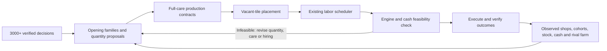

# A semantic production architecture for Kaggriculture

**Implementation update:** the modules, integrated agent, archived package and
benchmark results are now documented in
[the implementation report](semantic_farm_implementation_20260924.md).
The proposal and initial 35-game study below are retained as historical context.

24 September 2026. Proposal plus a tested daily-contract prototype; no complete new
playing policy or competitive improvement is claimed. All days are zero based.

**Recommendation: build a shop-conditioned production planner that chooses dated
cohort quantities, generates full useful maintenance, allocates vacant tiles and
asks our existing scheduler to produce routes.** Leader replays supply examples
of decisions and viable production families. Their worker commands should not be
the runtime representation of the strategy.



The reason for changing the representation is concrete. In the existing
[coherent-opening experiment](coherent_opening_execution_20260924.md), semantic
input timing recovered 14,300 cash per game relative to fragile replay of the
new opening. Nevertheless, the repaired 112-tape complete policy earned 4,626
less than m1. Adding 32 tapes did not establish an improvement. Matching crop
labels also admitted a continuation with incompatible seeds, ages and funding,
followed by a 29,536 cash loss in one saved case. Those results justify improving
execution and decision representation; they do not establish that early berries
are economically inferior.

| Approach | What it offers | Assessment |
|---|---|---|
| Keep adding tape-selection and repair rules | Small, measurable changes to a working agent | Retain as a control; it cannot generate arbitrary cohorts or layouts. |
| Semantic imitation plus bounded planning | Interpretable quantity proposals, new layouts and state-based service | Recommended. Reuse engine, economic models and scheduler; add explicit contracts. |
| Learn raw hourly actions end to end | Potentially broad strategy search | A much larger learning problem; unnecessary before semantic execution is reliable. |

The production planner should search a small set of coherent alternatives:
preserve the incumbent plan, adopt a compatible leader-family decision, or change
a few integer cohort quantities. Use enumeration/beam search initially; a mixed
integer master problem can become worthwhile once cash and route costs are
calibrated. Route feasibility must feed back into the production choice. A
tile-day capacity estimate alone is not a labor plan.

## What the study currently supports

The saved rating snapshot is **2026-09-24 09:16:42 UTC**. It supplies six qualifying
submissions from five teams: DSM 56495569 (3128.8), DSM 56498734 (3105.1), DECEM
56489091 (3047.0), M & M & P & Q 56497780 (3043.7), Vadim Vasilenko 56501059
(3023.5), and Unknown Mother-Goose 56507372 (3000.6). These are timestamped
submission ratings, not a claim to have refreshed the live leaderboard. The
2996.1 Fourth Quadrant submission is outside this study cohort.

The [opening review](leader_opening_review_20260924.md) supports two initial
families:

- DSM/DECEM/Vadim/current UMG: two cows, three sheep, roughly ten melons and ten
  strawberries by day 6, with strawberries beginning on day 2. Much of this
  opening precedes the first shop and must be justified using an ex ante demand
  distribution, rather than the shops that happen to appear later.
- M & M & P & Q: a distinct day-3 herd branch, with more sheep after Yarn and
  more cows after Smoothie/Bakery in the small opening sample. Preserve its
  financing and crop sequence when proposing this family.

The new extraction pass admits **35 verified full-season DSM games**, containing
**1,050 daily decisions and 101,384 default-service opportunities**. It excludes
109 older traces without a qualifying exact-submission rating and excludes every
benchmark episode before admitting any donor. Eighteen existing opening profiles
cover the qualifying submissions, but full-season semantic job evidence in this
new corpus is still DSM-only. The other families need the same full-season
extraction before their later decisions can be learned comparably.

For example, the DSM data show the following **new placements/plantings during
days 12–14**, grouped by shops already revealed at day 12:

| Decision | Revealed relevant shops | Games | Mean new quantity | Observed range |
|---|---:|---:|---:|---:|
| Sheep | 0 Yarn Stores | 22 | 0.00 | 0–0 |
| Sheep | 1 Yarn Store | 11 | 1.00 | 0–4 |
| Sheep | 2 Yarn Stores | 2 | 3.50 | 3–4 |
| Strawberry | 0 consuming shops | 3 | 2.67 | 2–3 |
| Strawberry | 1 consuming shop | 6 | 2.17 | 1–7 |
| Strawberry | 2 consuming shops | 14 | 5.00 | 0–9 |
| Strawberry | 3 consuming shops | 10 | 7.00 | 0–12 |
| Strawberry | 4 consuming shops | 2 | 8.50 | 8–9 |

These are useful proposal ranges, not fitted decision rules or causal effects.
Starting assets, earlier shops, cash, opponent supply and available land differ.
In particular, two games cannot establish a reliable two-Yarn quantity rule.
Zeros belong in the training data, including decisions to retain a crop rather
than replace it. Preserve joint decisions across products instead of independently
combining their best observed counts.

For each decision, the eventual model should receive the day, ordered revealed
shop prefix and demand counts, exact crop/animal cohorts, pending output and care
state, held inputs, cash, land, labor availability, market inventory and public
rival production. Its targets should be **new quantity, establishment window,
retirement/replacement condition and service exceptions**. Harvest output is a
consequence of earlier commitments, not a substitute for planting labels. The
prototype corpus already stores successful establishment labels, cohort counts,
cash and stock; richer state/market features and fitted conditional proposals
remain work for the next stage.

## Full useful maintenance, then explicit exceptions

Start with a service calendar that protects survival and captures attainable
production. Do not imitate a missing expert command as an intentional skip.
The observation may instead reflect active fertilizer, a harvest/replacement,
failed inputs, lack of labor, a holding cap, or service whose effect was earned
earlier. Record uncertain omissions as **intent unknown**.

Our engine's animal timing is especially important: it consumes accumulated care
bonuses for tonight's production **before** crediting today's fed-and-cared bonus.
That new bonus benefits a later tick. Current crop fertilizer likewise lasts
three inclusive days, so renewing it every day is unnecessary. The final day has
23 actions and no day-30 production refresh.

The prototype's single-tile engine counterfactuals demonstrate:

| One omitted service | Assumptions | Result |
|---|---|---|
| Cow CARE on day 0 | Full subsequent care and prompt harvesting | Same 36 milk and 29 fertilizer; one fewer command. Early bonus saturation makes this omission harmless. |
| Wheat WATER on day 1 | Planted and watered on day 0; full later care | Same six wheat; one fewer command. |
| Wheat WATER on planting day 0 | Full later care attempted | Plant dies; six wheat lost. Planting starts its unwatered counter at one. |

These examples measure physical effects, not farm profit or route savings. They
are not independent permissions to stack omissions. After proposing several
skips, re-simulate the combined calendar, survival, harvest, inputs and routes.

For economically meaningful exceptions, compare the additional competitive cash
margin from the service with its fertilizer/feed expense and **incremental route
and hiring cost**, including the value of other displaced jobs. Use predicted
prices at delivery under revealed demand and plausible rival supply, rather than
today's spot price alone. Keep full care when the estimate is uncertain. Animal
retirement and crop replacement need explicit plans; they must not emerge from an
unexplained failure to feed or water.

The corpus records sheep CARE in 1,211/1,696 default opportunities with no Yarn
Store and 2,189/2,473 with at least one. This is consistent with demand-sensitive
care, but age, calendar and herd composition confound the comparison. These
tile-days are not 4,169 independent games.

## Layout and labor should be solved together

Use expected remaining **service visits** as a central-placement preference.
Repeated feed/care/collection, fertilizer pickups and product delivery all
contribute; commands performed during one visit should not be counted as separate
round trips. Plan adjacent cohorts that share service dates, and reserve central
vacancies for later high-service assets when that option has value.

The new prototype allocates only vacant, owned tiles by descending supplied
service load and ascending distance to the nearest of the four shed-access cells.
That exactly minimizes this simple weighted-distance objective. It does not
optimize full tours, choose land purchases, or move established assets. A complete
layout optimizer should compare several such assignments using actual scheduler
costs, including harvest peaks, delivery capacity and future replacements. Layout
is an enabling improvement; previous results do not show it is the main source
of the leaders' advantage.

The reusable scheduler is `scripts/fragments/continuation_executor.py`, which
builds fresh worker routes from tile jobs and current worker positions. The older
`router_scheduler.py` remains tied to template routes. The fixed-production labor
optimizer is useful after a valid plan exists, but cannot by itself create the
requested crops, purchase their inputs or establish a new opening.

Every production contract ultimately needs:

- Cohort identities and counts, permissible tiles, establishment and release
  dates, protected assets and full service calendars.
- Intraday precedence and input deadlines: buy before pickup, pickup before
  feed/fertilize/place, fertilize before yield-producing water when required,
  harvest before replacement, deliver before sale and before capacity is lost.
- A cash path through critical land purchases and the next morning's wages.
  Preserve required capital jobs; previous tests show that cancelling land to
  save a few wages can destroy the whole continuation.
- Measured outcomes, including successful service, deliveries, stock, survival
  and unresolved jobs. Issuing a command does not complete the obligation.

Plan production through season end with uncertainty over unrevealed shops, commit
short windows, and replan at every reveal and execution failure. Rebuild today's
routes from observed state. A failed plan on a redesigned farm needs a feasible
continuation for that farm; blindly falling back to an old coordinate tape is not
a valid recovery strategy.

## Implemented boundary and remaining work

[semantic_strategy.py](../scripts/semantic_strategy.py) now provides quantity
contracts, central placement, useful-maintenance generation, single-service
counterfactuals and a daily adapter to the existing scheduler. It is research
code, not a submission. Its new validation checks **all** scheduled physical jobs,
including FEED, CARE, WATER and FERTILIZE. The existing continuation window check
only required successful establishment/harvesting; failed maintenance could pass
that check. This adapter rejects such plans before returning executable actions.

Fourteen focused tests pass. They include new sheep/wheat establishment with
generated purchases and fresh routes, agreement of the resulting farm and private
inventory with the full checked-in interpreter, a deliberately suppressed CARE,
cash shortfall, stale crop-age/stock contracts, terminal delivery, care-bonus timing, and exclusion of future shops
from donor features. The checked-in engine and the installed engine have identical
SHA-256 hashes. This is bounded mechanical validation, not a full-season opening
or competitive benchmark.

The adapter projects one day with no rival trades or new weeds, requires dawn
entry, and preserves a caller-supplied cash reserve. It does not yet provide a
multi-day funding ledger, sale policy, land/replacement planner, trained quantity
selector, whole-opening reconstruction, or a complete state-based fallback.
Those are explicit remaining architecture components, not capabilities supplied
automatically by the scheduler. Its supplied service-load weights also need to be
derived from planned calendars in the eventual planner.

## Benchmark contract

Use **3000+ submissions for study and 2750–3000 opponents for evaluation**.
Freeze rating time, exact submission, team, replay IDs, game/rules version, shops,
seeds, native seat and hashes. A team's new low-rated upload is not interchangeable
with the submission responsible for its leaderboard position. Assign exact 3000
to study and use [2750,3000) for a new disjoint benchmark roster.

The existing `p2750` panel has **185 games from 61 represented teams**: 81 own
ladder games and 104 team-vs-team games, with recorded team ratings 2750–2985.6.
Its metadata lists 64 eligible teams, which differs from actual representation.
It qualifies by team score, and recorded submission ratings are not independently
verified. Keep this panel as the established development regression suite with
that label. Verify exact submission ratings for a new strict panel rather than
quietly relabeling these recordings.

Compare with frozen m1, y3 and the current **budgeted** V9+y3 package, because
runtime budgets can change V9's policy decisions. Use matched worlds and report
win/draw/loss score, paired cash margin, lower-tail losses, missed obligations and
latency. Report uncertainty by episode and opponent family, with score by rating
band and team-balanced summaries so prolific opponents do not dominate.

Frozen opponent actions cannot react to our production and price changes. Keep
their validity diagnostics and report all cases plus a predeclared validity
sensitivity analysis; do not hide losses by dropping broken tapes after seeing
results. Add responsive local opponents on untouched worlds in both seats. V56
is one useful control, not the entire 2750–3000 population. Without live binaries
for the closed-source leaders, recorded wins do not establish live wins against
those policies, and no score here establishes a new Elo rating.

The existing panel and prior qualification cases have already guided development.
Do not call them an untouched test. Freeze new episode/seed groups before final
qualification; both seats of an episode stay in one split, and any shared expert
episode is excluded. Use chronological/submission-family holdouts for proposal
learning as well as episode-level splits.

Recommended sequence: first reproduce one complete DSM-style opening and its
continued obligations with semantic jobs; then admit quantity changes conditioned
on revealed shops; then compare layout and care exceptions in separate ablations.
Every stage needs a coherent full-season continuation. Run independent final
qualification only after the complete candidate and its runtime limits are frozen.

Artifacts: [study and provenance](../results/fresh/semantic_architecture_20260924/study.json),
[builder](../scripts/build_semantic_strategy_study.py), and
[engine checks](../tests/test_semantic_strategy.py). Reproduce with:

```powershell
.venv\Scripts\python.exe scripts\build_semantic_strategy_study.py
.venv\Scripts\python.exe tests\test_semantic_strategy.py
```
